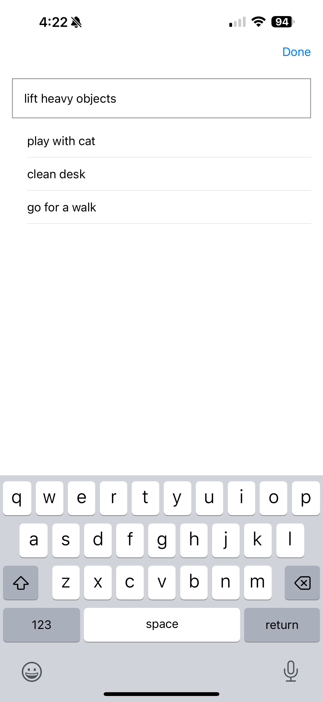
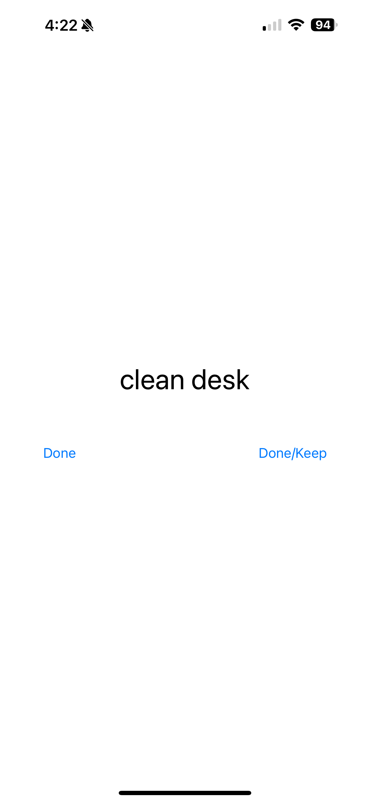

# EphemeralToDo

Got a lot of junk to do today but motivated to do none of it?  Toss them in to
a list, pick a random one when you have some time to do something.

When you're done, they go _poof_.

## Broad Strokes of "Design"

two main modes, Entry and Run

* Entry Mode
  - Text field
  - type something
  - return make a new entry and put into a list
  - Text field stays focused _(this is what defeated me last time with SwiftUI...)_
  - Button to move to run mode

* Run Mode
  - Press a button to roll the dice
  - display one of the list
  - button "done / done and keep"
    - done will nuke the item from the list and go back to the roll screen
    - done and keep will go to the roll screen but not nuke the item

## Huh. It works

| Adding things to the list. | Roll! | Picked one! |
| --- | --- | --- |
|  |   |  |

## Demo Movie!

https://github.com/markd2/EphemeralToDo/assets/609957/5c06daa6-3a11-47ac-83ec-9afa688c5e0f

